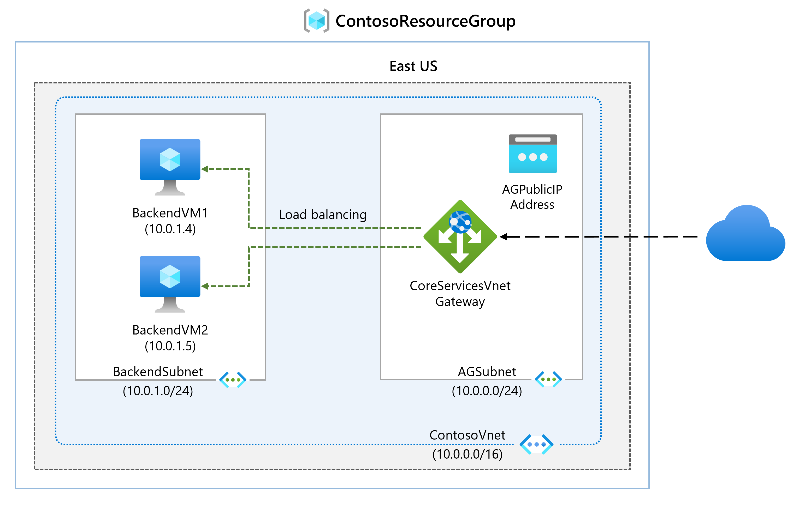
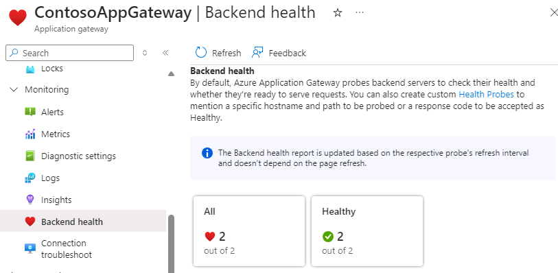

---
Exercise:
  title: M05 – Unité 4 Déployer une passerelle applicative Azure
  module: Module 05 - Load balancing HTTP(S) traffic in Azure
---

# M05 – Unité 4 Déployer une passerelle applicative Azure

## Scénario de l’exercice

Dans cet exercice, vous allez utiliser le Portail Azure pour créer une passerelle applicative. Puis, vous la testerez pour vous assurer qu’elle fonctionne correctement.




   >**Remarque :** Une **[simulation de labo interactive](https://mslabs.cloudguides.com/guides/AZ-700%20Lab%20Simulation%20-%20Deploy%20Azure%20Application%20Gateway)** est disponible et vous permet de progresser à votre propre rythme. Il peut exister de légères différences entre la simulation interactive et le labo hébergé. Toutefois, les concepts et idées de base présentés sont identiques.

### Durée estimée : 25 minutes

La passerelle d’application dirige le trafic web des applications vers des ressources spécifiques d’un pool de back-ends. Vous attribuez des écouteurs aux ports, créez des règles et ajoutez des ressources à un pool de back-ends. Par souci de simplicité, cet article utilise une configuration simple avec une adresse IP front-end publique, un écouteur de base pour héberger un site unique sur cette passerelle d’application, une règle de routage des requêtes simple et deux machines virtuelles dans le pool de back-ends.

Azure a besoin d’un réseau virtuel pour communiquer avec les différentes ressources que vous créez. Vous pouvez créer un réseau virtuel ou en utiliser un. Dans cet exemple, vous allez créer un réseau virtuel en même temps que la passerelle applicative. Les instances Application Gateway sont créées dans des sous-réseaux séparés. Vous créez deux sous-réseaux dans cet exemple : un pour la passerelle d’application et un autre pour les serveurs back-end.

Dans cet exercice, vous allez :

+ Tâche 1 : créer une passerelle applicative
+ Tâche 2 : créer des machines virtuelles
+ Tâche 3 : ajouter des serveurs back-end au pool de back-ends
+ Tâche 4 : tester la passerelle applicative

## Tâche 1 : créer une passerelle applicative

1. Connectez-vous au [portail Azure](https://portal.azure.com/) avec votre compte Azure.

1. Sur n’importe quelle page du portail Azure, dans **Rechercher des ressources, des services et des documents (G+/)**, entrez passerelle applicative, puis sélectionnez **Passerelles applicatives** dans les résultats.
    

1. Dans la page Passerelles applicatives, sélectionnez **+ Créer**.

1. Sous l’onglet Créer les **Informations de base** de la passerelle applicative, entrez ou sélectionnez les informations suivantes :

   | **Paramètre**         | **Valeur**                                    |
   | ------------------- | -------------------------------------------- |
   | Abonnement        | Sélectionnez votre abonnement.                    |
   | Resource group      | Sélectionnez CréerContosoResourceGroup.       |
   | Application Gateway | ContosoAppGateway                            |
   | Région              | Sélectionnez **USA Est**.                           |
   | Réseau virtuel     | Sélectionnez **Créer**                        |

1. Dans Créer un réseau virtuel, entrez ou sélectionnez les informations suivantes :

   | **Paramètre**       | **Valeur**                          |
   | ----------------- | ---------------------------------- |
   | Nom              | ContosoVNet                        |
   | **ESPACE D’ADRESSAGE** |                                    |
   | Plage d’adresses     | 10.0.0.0/16                        |
   | **SOUS-RÉSEAUX**       |                                    |
   | Nom du sous-réseau       | Modifier la **valeur par défaut** par **AGSubnet** |
   | Plage d’adresses     | 10.0.0.0/24                        |


1. Sélectionnez **OK** pour revenir à l’onglet Créer les informations de base de la passerelle applicative.

1. Acceptez les valeurs par défaut des autres paramètres, puis sélectionnez **Suivant : Serveurs frontaux**.

1. Sous l’onglet **Front-ends**, vérifiez que **Type d’adresse IP de front-end** est défini sur **Publique**.

1. Sélectionnez **Ajouter nouveau** pour l'**adresse IP publique** et entrez AGPublicIPAddress pour le nom de l’adresse IP publique, puis sélectionnez **OK**.

1. Sélectionnez **Suivant : Back-ends**.

1. Sous l’onglet **Backends**, sélectionnez **Ajouter un pool de back-ends**.

1. Dans la fenêtre **Ajouter un pool back-end** qui s’ouvre, entrez les valeurs suivantes pour créer un pool back-end vide :

    | **Paramètre**                      | **Valeur**   |
    | -------------------------------- | ----------- |
    | Nom                             | BackendPool |
    | Ajouter un pool back-end sans cible | Oui         |

1. Dans la fenêtre **Ajouter un pool back-end**, sélectionnez  **Ajouter** pour enregistrer la configuration du pool back-end et revenir à l’onglet **Back-ends**.

1. Sous l’onglet **Back-ends**, sélectionnez **Suivant : Configuration**.

1. Sous l’onglet **Configuration**, vous allez connecter le front-end et le pool de back-ends que vous avez créés à l’aide d’une règle de routage.

1. Dans la colonne **Règles de routage**, sélectionnez **Ajouter une règle de routage**.

1. Dans la zone **Nom de la règle**, entrez **RoutingRule**.

1. Pour **Priorité**, entrez **100**. 

1. Sous l’onglet **Écouteur**, entrez ou sélectionnez les informations suivantes :

    | **Paramètre**   | **Valeur**         |
    | ------------- | ----------------- |
    | Nom de l’écouteur | Port d'écoute          |
    | Adresse IP du front-end   | Sélectionnez **Adresse IPv4 publique**. |

1. Acceptez les valeurs par défaut pour les autres paramètres de l’onglet **Écouteur**.

    

1. Sélectionnez l’onglet **Cibles back-end** pour configurer le reste de la règle de routage.

1. Sous l’onglet **Cibles back-end**, entrez ou sélectionnez les informations suivantes :

    | **Paramètre**      | **Valeur**      |
    | -------------    | -------------- |
    | Type cible      | Pool back-end   |
    | Paramètres back-end | **Ajouter nouveau** |

1. Dans **Ajouter un paramètre back-end**, entrez ou sélectionnez les informations suivantes :

    | **Paramètre**          | **Valeur**   |
    | ------------------   | ----------- |
    | Nom du paramètre back-end | HTTPSetting |
    | Port principal         | 80          |

1. Acceptez les valeurs par défaut pour les autres paramètres de la fenêtre **Ajouter un paramètre back-end**, puis sélectionnez **Ajouter** pour revenir à **Ajouter une règle de routage**.

1. Sélectionnez **Ajouter** pour enregistrer la règle de routage et revenir à l’onglet **Configuration**.

1. Sélectionnez **Suivant : Balises**, puis sur **Suivant : Vérifier + créer**.

1. Analysez les paramètres de l’onglet **Analyser + créer**

1. Sélectionnez **Créer** pour créer le réseau virtuel, l’adresse IP publique et la passerelle applicative.

1. La création de la passerelle d’application par Azure peut prendre plusieurs minutes. Attendez la fin du déploiement.

### Ajouter un sous-réseau pour un serveur backend

1. Recherchez et sélectionnez le **ContosoVNet**. Vérifiez que le **AGSubnet** a été créé. 

1. Pour créer le **BackendSubnet**, sélectionnez **Paramètres**, puis **Subnets**. Veillez à **ajouter** le sous-réseau lorsque vous avez terminé.
   
   | **Paramètre**       | **Valeur**                          |
   | ----------------- | ---------------------------------- |
   | Nom du sous-réseau       | BackendSubnet                      |
   | Plage d’adresses     | 10.0.1.0/24                        |

## Tâche 2 : créer des machines virtuelles

1. Sélectionnez l’icône Cloud Shell en haut à droite du portail Azure. Si nécessaire, configurez l’interpréteur de commandes.  
    + Sélectionnez **PowerShell**.
    + Sélectionnez **Aucun compte de stockage requis** et votre **abonnement**, puis sélectionnez **Appliquer**.
    + Attendez que le terminal crée et qu’une invite s’affiche.
      
1. Dans la barre d’outils du volet Cloud Shell, sélectionnez **Gérer les fichiers**, puis **Charger**. Chargez les fichiers suivants : **backend.json**, **backend.parameters.json** et **install-iis.ps1**. Les fichiers peuvent être téléchargés à partir du référentiel, dans le dossier **\Allfiles\Exercises\M05**.

1. Déployez les modèles ARM suivants pour créer les machines virtuelles nécessaires à cet exercice :

   >**Remarque** : Vous serez invité à fournir un mot de passe d’administrateur. 

   ```powershell
   $RGName = "ContosoResourceGroup"
   
   New-AzResourceGroupDeployment -ResourceGroupName $RGName -TemplateFile backend.json -TemplateParameterFile backend.parameters.json
   ```
   >**Remarque** : prenez le temps de passer en revue le fichier **backend.json**. Deux machines virtuelles sont en cours de déploiement. Cette opération prendra quelques minutes. 

1. La commande doit s’exécuter correctement et lister **BackendVM1** et **BackendVM2**.

### Installer IIS sur chaque machine virtuelle

1. Chaque serveur back-end nécessite qu’IIS soit installé.

1. Continuez vers l’invite PowerShell et utilisez le script fourni pour installer IIS sur **BackendVM1**.

   ```powershell
   Invoke-AzVMRunCommand -ResourceGroupName 'ContosoResourceGroup' -Name 'BackendVM1' -CommandId 'RunPowerShellScript' -ScriptPath 'install-iis.ps1'
   ```

   >**Remarque** : pendant que vous patientez, vérifiez le script PowerShell. Notez que la page d’accueil IIS est personnalisée de manière à indiquer le nom de la machine virtuelle.

1. Exécutez à nouveau la commande, cette fois pour **BackendVM2**.

   ```powershell
   Invoke-AzVMRunCommand -ResourceGroupName 'ContosoResourceGroup' -Name 'BackendVM2' -CommandId 'RunPowerShellScript' -ScriptPath 'install-iis.ps1'
   ```
   >**Remarque :** chacune des commandes prend quelques minutes à s’exécuter.

## Tâche 3 : ajouter des serveurs back-end au pool de back-ends

1. Dans le menu du Portail Azure, sélectionnez **Toutes les ressources** ou recherchez et sélectionnez Toutes les ressources. Sélectionnez ensuite **ContosoAppGateway**.

1. Sous **Paramètres**, sélectionnez **Backend Pools (Pools principaux)** .

1. Sélectionnez **BackendPool**.

1. Dans la page Modifier le pool back-end, sous **Cibles back-end**, dans **Type de cible**, sélectionnez **Machine virtuelle**.

1. Dans **Cible**, sélectionnez **BackendVM1-nic.**

1. Dans **Type de cible**, sélectionnez **Machine virtuelle**.

1. Dans **Cible**, sélectionnez **BackendVM2-nic.**

   

1. Sélectionnez **Enregistrer** et attendez que les cibles soient ajoutées. 

1. Vérifiez que les serveurs back-end sont sains. Sélectionnez **Surveillance**, puis **Intégrité du back-end**. Les deux cibles doivent être saines. 

   

## Tâche 4 : tester la passerelle applicative

IIS n’est pas obligatoire pour créer la passerelle applicative, mais vous l’avez installé dans cet exercice pour vérifier si Azure avait bien créé la passerelle applicative.

### Utiliser IIS pour tester la passerelle applicative

1. Recherchez l’adresse IP publique de la passerelle d’application dans la page **Vue d’ensemble** correspondante.

   

1. Copiez l’adresse IP publique, puis collez-la dans la barre d’adresses de votre navigateur pour y accéder.

1. Vérifiez la réponse. Une réponse valide vérifie que la passerelle d’application a bien été créée avec succès et qu’elle est capable de se connecter au back-end.

   

1. Actualisez plusieurs fois le navigateur et vous devriez voir les connexions à BackendVM1 et BackendVM2.

## Nettoyer les ressources

   >**Remarque** : N’oubliez pas de supprimer toutes les nouvelles ressources Azure que vous n’utilisez plus. La suppression des ressources inutilisées vous évitera d’encourir des frais inattendus.

1. Dans le portail Azure, ouvrez la session **PowerShell** dans le volet **Cloud Shell**.

1. Supprimez tous les groupes de ressources que vous avez créés dans les labos de ce module en exécutant la commande suivante :

   ```powershell
   Remove-AzResourceGroup -Name 'IntLB-RG' -Force -AsJob
   ```

>**Remarque** : La commande s’exécute de façon asynchrone (tel que déterminé par le paramètre -AsJob). Vous pourrez donc exécuter une autre commande PowerShell immédiatement après au cours de la même session PowerShell, mais la suppression effective du groupe de ressources peut prendre quelques minutes.

## Développer votre apprentissage avec Copilot

Copilot peut vous aider à apprendre à utiliser les outils de script Azure. Copilot peut également aider dans des domaines non couverts dans le labo ou quand vous avez besoin de plus d’informations. Ouvrez un navigateur Edge et choisissez Copilot (en haut à droite), ou accédez à *copilot.microsoft.com*. Prenez quelques minutes pour essayer ces invites.
+ Comment Azure Application Gateway achemine-t-il les requêtes ?
+ Quelles sont les fonctionnalités de sécurité d’Azure Application Gateway ?
+ Comparez Azure Application Gateway avec Azure Load Balancer. Donnez des exemples de situations dans lesquelles utiliser chaque produit.


## En savoir plus grâce à l’apprentissage auto-rythmé

+ [Présentation d’Azure Application Gateway](https://learn.microsoft.com/training/modules/intro-to-azure-application-gateway/). Ce module explique à quoi sert Azure Application Gateway, comment il fonctionne et quand choisir de l’utiliser comme solution pour répondre aux besoins de votre organisation.
+ [Équilibrer la charge du trafic de votre service web avec Application Gateway](https://learn.microsoft.com/training/modules/load-balancing-https-traffic-azure/). Dans ce module, vous allez apprendre à créer et configurer Application Gateway avec le routage basé sur le chemin de l’URL.
+ [Équilibrez la charge du trafic HTTP(S) dans Azure](https://learn.microsoft.com/training/modules/load-balancing-https-traffic-azure/). Dans ce module, vous allez apprendre à concevoir et à implémenter Azure Application Gateway.

## Points clés

Félicitations, vous avez terminé le labo. Voici les principaux points à retenir de ce labo. 
+ Azure Application Gateway est un équilibreur de charge de trafic web (couche OSI 7) qui vous permet de gérer le trafic vers vos applications web.
+ Application Gateway peut prendre des décisions de routage basées sur des attributs supplémentaires d’une requête HTTP, par exemple des en-têtes d’hôte ou le chemin d’un URI.
+ Utilisez Application Gateway pour l’application hébergée dans une seule région et lorsque vous avez besoin d’un routage basé sur une URL. 
