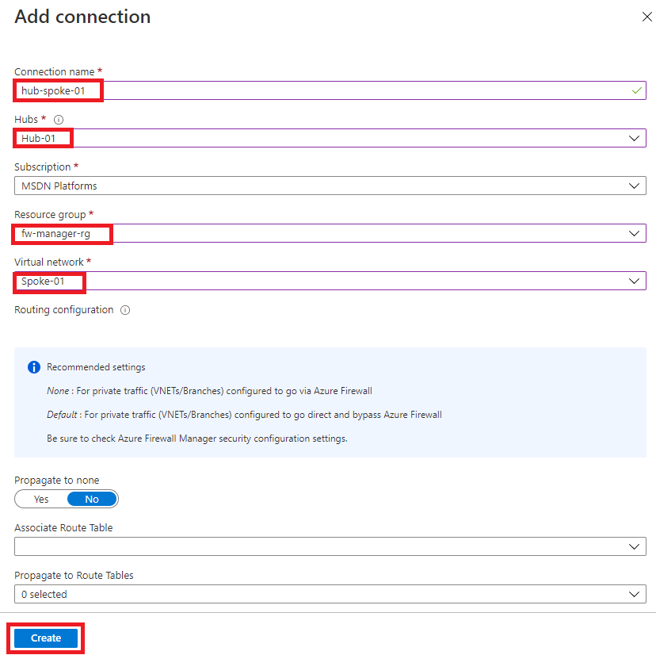
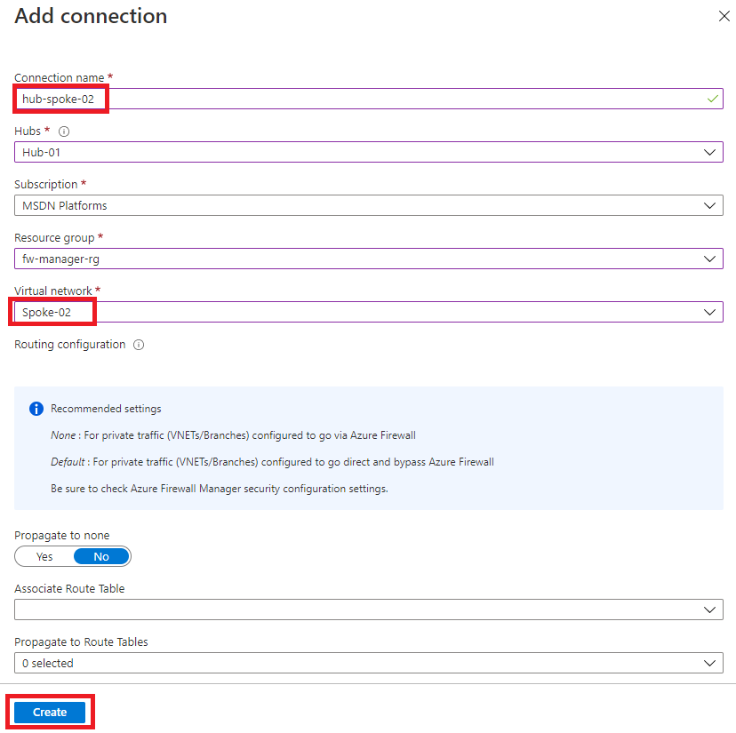
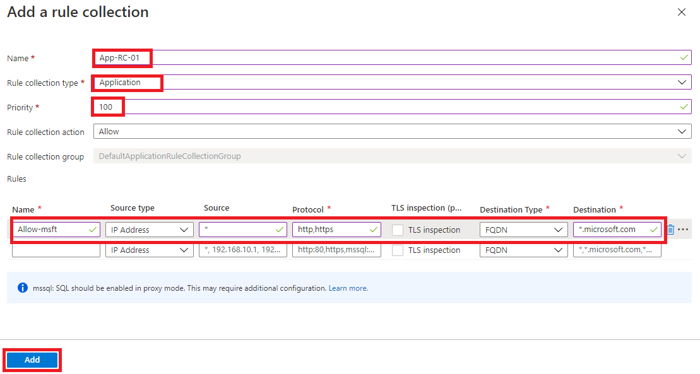
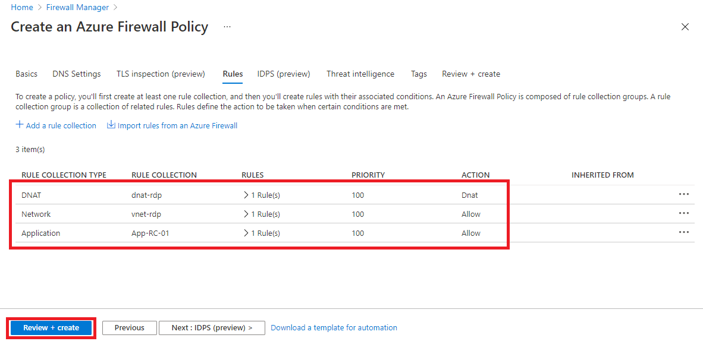

---
Exercise:
  title: "M06 - Unité 9 Sécuriser votre hub virtuel avec Azure\_Firewall\_Manager"
  module: Module 06 - Design and implement network security
---


# M06 - Unité 9 Sécuriser votre hub virtuel avec Azure Firewall Manager

## Scénario de l’exercice

Dans cet exercice, vous allez créer le réseau virtuel Spoke et créer un hub virtuel sécurisé, puis connecter les réseaux virtuels Hub and Spoke et acheminer le trafic vers votre hub. Ensuite, vous allez déployer les serveurs de charge de travail, puis créer une stratégie de pare-feu et sécuriser votre hub. Enfin, vous allez tester le pare-feu.


**Remarque :** Une **[simulation de labo interactive](https://mslabs.cloudguides.com/guides/AZ-700%20Lab%20Simulation%20-%20Secure%20your%20virtual%20hub%20using%20Azure%20Firewall%20Manager)** est disponible et vous permet de progresser à votre propre rythme. Il peut exister de légères différences entre la simulation interactive et le labo hébergé. Toutefois, les concepts et idées de base présentés sont identiques.

## Créer une architecture hub and spoke

Dans cette partie de l’exercice, vous allez créer les réseaux virtuels Spoke et les sous-réseaux dans lesquels vous allez placer les serveurs de charge de travail. Vous allez ensuite créer le hub virtuel sécurisé et connecter les réseaux virtuels Hub and Spoke.

Dans cet exercice, vous allez :

+ Tâche 1 : créer deux réseaux virtuels et sous-réseaux à rayons
+ Tâche 2 : créer le hub virtuel sécurisé
+ Tâche 3 : connecter les réseaux virtuels en étoile
+ Tâche 4 : déployer les serveurs
+ Tâche 5 : créer une stratégie de pare-feu et sécuriser votre hub
+ Tâche 6 : associer la stratégie de pare-feu
+ Tâche 7 : acheminer le trafic vers votre hub
+ Tâche 8 : tester la règle d’application
+ Tâche 9 : tester la règle réseau
+ Tâche 10 : Nettoyer les ressources

### Durée estimée : 35 minutes

## Tâche 1 : créer deux réseaux virtuels et sous-réseaux à rayons

Au cours de cette tâche, vous allez créer les deux réseaux virtuels Spoke contenant chacun un sous-réseau qui hébergera vos serveurs de charge de travail.

1. Sur la page d’accueil du portail Azure, dans la zone de recherche, entrez **Réseau virtuel**, puis sélectionnez **Réseau virtuel** lorsque la valeur apparaît.
2. Sélectionnez **Créer**.
3. Dans **Groupe de ressources**, sélectionnez **Créer**, puis entrez **fw-manager-rg** comme nom et sélectionnez **OK**.
4. Dans **Nom**, entrez **Spoke-01**.
5. Dans **Région**, sélectionnez votre région.
6. Sélectionnez **Suivant : Adresses IP**.
7. Dans **Espace d’adressage IPv4**, entrez **10.0.0.0/16**.
8. **Supprimez** tous les autres espaces d’adressage répertoriés ici, par exemple **10.1.0.0/16**.
9. Sous **Nom de sous-réseau**, sélectionnez le mot **par défaut**.
10. Dans la boîte de dialogue **Modifier le sous-réseau**, remplacez le nom par **Workload-01-SN**.
11. Remplacez la **Plage d’adresses de sous-réseau** par **10.0.1.0/24**.
12. Sélectionnez **Enregistrer**.
13. Sélectionnez **Revoir + créer**.
14. Sélectionnez **Create** (Créer).

Répétez les étapes 1 à 14 ci-dessus pour créer un autre réseau virtuel et un sous-réseau similaires, mais à l’aide des informations suivantes :

+ Groupe de ressources : **fw-manager-rg** (sélectionner un groupe existant)
+ Nom : **Spoke-02**
+ Espace d’adressage : **10.1.0.0/16** (supprimer tous les autres espaces d’adressage listés)
+ Nom du sous-réseau : **Charge de travail-02-SN**
+ Plage d’adresses de sous-réseau : **10.1.1.0/24**

## Tâche 2 : créer le hub virtuel sécurisé

Au cours de cette tâche, vous allez créer votre hub virtuel sécurisé à l’aide de Firewall Manager.

1. À partir de la page d’accueil du portail Azure, sélectionnez **Tous les services**.

2. Dans la zone de recherche, saisissez **Firewall Manager** et sélectionnez **Firewall Manager** lorsqu’il apparaît.

3. Sur la page **Firewall Manager**, à partir de la page Vue d’ensemble, sélectionnez **Voir les hubs virtuels sécurisés**.

4. Sur la page **Hubs virtuels**, sélectionnez **Créer un hub virtuel sécurisé**.

5. Pour **Groupe de ressources**, sélectionnez **fw-manager-rg**.

6. Pour **Région**, sélectionnez votre région.

7. Pour le **Nom du hub virtuel sécurisé**, entrez **Hub-01**.

8. Pour **Espace d’adressage du hub**, entrez **10.2.0.0/16**.

9. Choisissez **Nouveau WAN virtuel**.

10. Dans **Nom de WAN virtuel**, entrez **Vwan-01**.

11. Sélectionnez **Suivant : Pare-feu Azure**.
    

12. Sélectionnez **Suivant : Fournisseur de partenaire de sécurité**.

13. Sélectionnez **Suivant : Vérifier + créer**.

14. Sélectionnez **Créer**.

    > **[!NOTE]**
    >
    > Le déploiement peut durer jusqu’à 30 minutes.

    

    

15. Une fois le déploiement terminé, dans la page d’accueil du portail Azure, sélectionnez **Tous les services**.

16. Dans la zone de recherche, saisissez **Firewall Manager** et sélectionnez **Firewall Manager** lorsqu’il apparaît.

17. Dans la page **Firewall Manager**, sélectionnez **Afficher les hubs virtuels**.

18. Sélectionnez **Hub-01**.

19. Sélectionnez **Configuration d’adresse IP publique**.

20. Notez l’adresse IP publique (par exemple **51.143.226.18**), que vous utiliserez ultérieurement.

## Tâche 3 : connecter les réseaux virtuels en étoile

Au cours de cette tâche, vous allez connecter les réseaux virtuels Hub and Spoke. Cela est communément appelé peering.

1. Sur la page d’accueil du portail Azure, sélectionnez **Groupes de ressources**.
2. Sélectionnez le groupe de ressources **fw-manager-rg**, puis le WAN virtuel **Vwan-01**.
3. Sous **Connectivité**, sélectionnez **Connexions de réseau virtuel**.
4. Sélectionnez **Ajouter une connexion**.
5. Pour **Nom de la connexion**, entrez **hub-spoke-01**.
6. Pour **Hubs**, sélectionnez **Hub-01**.
7. Pour **Groupe de ressources**, sélectionnez **fw-manager-rg**.
8. Pour **Réseau virtuel**, sélectionnez **Spoke-01**.
9. Sélectionnez **Créer**.
   
10. Répétez les étapes 4 à 9 ci-dessus pour créer une autre connexion similaire, mais en utilisant le nom de connexion **hub-spoke-02** pour connecter le réseau virtuel **Spoke-02**.



## Tâche 4 : déployer les serveurs

1. Dans le portail Azure, ouvrez la session **PowerShell** dans le volet **Cloud Shell**.

1. Dans la barre d’outils du volet Cloud Shell, sélectionnez l’icône **Charger/télécharger des fichiers**, dans le menu déroulant, sélectionnez **Charger** et chargez les fichiers **FirewallManager.json** et **FirewallManager.parameters.json** l’un après l’autre dans le répertoire racine de Cloud Shell à partir du dossier source **F:\Allfiles\Exercises\M06**.

1. Déployez les modèles ARM suivants pour créer les machines virtuelles nécessaires à cet exercice :

   >**Remarque** : Vous serez invité à fournir un mot de passe d’administrateur.

   ```powershell
   $RGName = "fw-manager-rg"
   
   New-AzResourceGroupDeployment -ResourceGroupName $RGName -TemplateFile FirewallManager.json -TemplateParameterFile FirewallManager.parameters.json
   ```
  
1. Une fois le déploiement terminé, accédez à la page d’accueil du portail Azure, puis sélectionnez **Machines virtuelles**.

1. Dans la page **Vue d’ensemble** de **Srv-workload-01**, dans le volet de droite, sous la section **Réseau**, notez l’**Adresse IP privée** (par exemple **10.0.1.4**).

1. Dans la page **Vue d’ensemble** de **Srv-workload-02**, dans le volet de droite, sous la section **Réseau**, notez l’**Adresse IP privée** (par exemple **10.1.1.4**).

## Tâche 5 : créer une stratégie de pare-feu et sécuriser votre hub

Au cours de cette tâche, vous allez d’abord créer votre stratégie de pare-feu, puis sécuriser votre hub. La stratégie de pare-feu définit des collections de règles pour diriger le trafic sur un ou plusieurs hubs virtuels sécurisés.

1. Dans la page d’accueil du portail Azure, sélectionnez **Firewall Manager**.
   + Si l’icône de Firewall Manager n’apparaît pas sur la page d’accueil, sélectionnez **Tous les services**. Ensuite, dans la zone de recherche, saisissez **Firewall Manager** et sélectionnez **Firewall Manager** lorsqu’il apparaît.

1. Dans **Firewall Manager**, à partir de la page Vue d’ensemble, sélectionnez **Voir les stratégies de pare-feu Azure**.

1. Sélectionnez **Créer une stratégie de pare-feu Azure**.

1. Dans **Groupe de ressources**, sélectionnez **fw-manager-rg**.

5. Sous **Détails de la stratégie**, pour le **Nom**, entrez **Policy-01**.

1. Dans **Région**, sélectionnez votre région.

1. Dans **Niveau de stratégie**, sélectionnez **Standard**.

1. Sélectionnez **Suivant : Paramètres DNS**.

1. Sélectionnez **Suivant : Inspection TLS (préversion)**.

1. Sélectionnez **Suivant : Règles**.

1. Dans l’onglet **Règles**, sélectionnez **Ajouter une collection de règles**.

1. Dans la page **Ajouter un regroupement de règles**, dans **Nom**, entrez **App-RC-01**.

1. Pour **Type de collection de règles**, sélectionnez **Application**.

1. Pour **Priorité**, entrez **100**.

1. Vérifiez que **Action de collection de règles** est défini sur **Autoriser**.

1. Sous **Règles**, dans **Nom**, entrez **Allow-msft**.

1. Pour **Type de source**, sélectionnez **Adresse IP**.

1. Pour **Source**, entrez *.

1. Pour **Protocole**, entrez **http,https**.

1. Vérifiez que **Type de destination** est défini sur **FQDN**.

1. Pour **Destination**, entrez ***.microsoft.com**.

1. Sélectionnez **Ajouter**.

    

1. Pour ajouter une règle DNAT afin de pouvoir connecter un bureau à distance à la machine virtuelle Srv-workload-01, sélectionnez **Ajouter un regroupement de règles**.

1. Pour **Nom**, entrez **dnat-rdp**.

1. Comme **Type de collection de règles**, sélectionnez **DNAT**.

1. Pour **Priorité**, entrez **100**.

1. Sous **Règles**, dans **Nom**, entrez **Allow-rdp**.

1. Pour **Type de source**, sélectionnez **Adresse IP**.

1. Pour **Source**, entrez *.

1. Pour **Protocole**, sélectionnez **TCP**.

1. Pour **Ports de destination**, entrez **3389**.

1. Pour **Type de destination**, sélectionnez **Adresse IP**.

1. Pour **Destination**, entrez l’adresse IP publique du hub virtuel du pare-feu que vous avez notée précédemment (par exemple **51.143.226.18**).

1. Pour **Adresse traduite**, entrez l’adresse IP privée pour **Srv-workload-01** que vous avez notée précédemment (par exemple **10.0.1.4**).

1. Pour **Port traduit**, entrez **3389**.

1. Sélectionnez **Ajouter**.

1. Pour ajouter une règle réseau afin de pouvoir connecter un bureau à distance de la machine virtuelle Srv-workload-01 à Srv-workload-02, sélectionnez **Ajouter un regroupement de règles**.

1. Pour **Nom**, entrez **vnet-rdp**.

1. Comme **Type de collection de règles**, sélectionnez **Réseau**.

1. Pour **Priorité**, entrez **100**.

1. Pour **Action de collection de règles**, sélectionnez **Autoriser**.

1. Sous **Règles**, dans **Nom**, entrez **Allow-vnet**.

1. Pour **Type de source**, sélectionnez **Adresse IP**.

1. Pour **Source**, entrez *.

1. Pour **Protocole**, sélectionnez **TCP**.

1. Pour **Ports de destination**, entrez **3389**.

1. Pour **Type de destination**, sélectionnez **Adresse IP**.

1. Pour **Destination**, entrez l’adresse IP privée pour **Srv-workload-02** que vous avez notée précédemment (par exemple **10.1.1.4**).

1. Sélectionnez **Ajouter**.

    

1. Vous devez maintenant avoir trois regroupements de règles.

1. Sélectionnez **Revoir + créer**.

1. Sélectionnez **Create** (Créer).

## Tâche 6 : associer la stratégie de pare-feu

Au cours de cette tâche, vous allez associer la stratégie de pare-feu au hub virtuel.

1. Dans la page d’accueil du portail Azure, sélectionnez **Firewall Manager**.
   + Si l’icône de Firewall Manager n’apparaît pas sur la page d’accueil, sélectionnez **Tous les services**. Ensuite, dans la zone de recherche, saisissez **Firewall Manager** et sélectionnez **Firewall Manager** lorsqu’il apparaît.
1. Dans **Firewall Manager**, sous **Sécurité**, sélectionnez **Stratégies de pare-feu Azure**.
1. Cochez la case **Policy-01**.
1. Sélectionnez **Gérer les associations&gt;associer des hubs**.
1. Activez la case à cocher **Hub-01**.
1. Sélectionnez **Ajouter**.
1. Une fois la stratégie attachée, sélectionnez **Actualiser**. L’association doit être affichée.


## Tâche 7 : acheminer le trafic vers votre hub

Pour cette tâche, vous devez vérifiez que le trafic réseau est acheminé via votre pare-feu.

1. Dans **Firewall Manager**, sélectionnez **Hubs virtuels**.
1. Sélectionnez **Hub-01**.
1. Sous **Paramètres**, sélectionnez **Configuration de la sécurité**.
1. Dans **Trafic Internet**, sélectionnez **Pare-feu Azure**.
1. Dans **Trafic privé**, sélectionnez **Envoyer via le pare-feu Azure**.
1. Sélectionnez **Enregistrer**.
1. L’exécution de cette opération nécessite quelques minutes.
1. Une fois la configuration terminée, vérifiez que sous **TRAFIC INTERNET** et **TRAFIC PRIVÉ**, vous pouvez voir **Sécurisé par le pare-feu Azure** pour les connexions Hub and Spoke.

## Tâche 8 : tester la règle d’application

Dans cette partie de l’exercice, vous allez connecter un bureau à distance à l’adresse IP publique du pare-feu, traduite par NAT en Srv-workload-01. De là, vous allez utiliser un navigateur web pour tester la règle d’application et connecter un bureau à distance à Srv-Workload-02 pour tester la règle réseau.

Dans cette tâche, vous allez tester la règle d’application pour confirmer qu’elle fonctionne comme prévu.

1. Ouvrez **Connexion Bureau à distance** sur votre PC.

1. Dans la zone **Ordinateur**, entrez l’**adresse IP publique du pare-feu** (par exemple **51.143.226.18**).

1. Sélectionnez **Afficher les options**.

1. Dans la zone **Nom d’utilisateur**, entrez **TestUser**.

1. Sélectionnez **Se connecter**.

   

1. Dans la boîte de dialogue **Entrez vos informations d’identification**, connectez-vous à la machine virtuelle du serveur **Srv-workload-01** à l’aide du mot de passe que vous avez spécifié pendant le déploiement.

1. Cliquez sur **OK**.

1. Sélectionnez **Oui** dans le message du certificat.

1. Ouvrez Internet Explorer, puis sélectionnez **OK** dans la boîte de dialogue **Configurer Internet Explorer 11**.

1. Accédez à **https://** **<www.microsoft.com>**.

1. Dans la boîte de dialogue **Alerte de sécurité**, sélectionnez **OK**.

1. Sélectionnez **Fermer** dans les alertes de sécurité Internet Explorer qui peuvent apparaître.

1. La page d’accueil de Microsoft doit s’afficher.

    

1. Accédez à **https://** **<www.google.com>**.

1. Vous devriez être bloqué par le pare-feu.

    

1. Ainsi, vous avez vérifié que vous pouvez vous connecter au nom de domaine complet (FQDN) autorisé, mais que tous les autres vous bloquent.

## Tâche 9 : tester la règle réseau

Dans cette tâche, vous allez tester la règle réseau pour confirmer qu’elle fonctionne comme prévu.

1. En étant toujours connecté à la session RDP **Srv-workload-01**, à partir de cet ordinateur distant, ouvrez **Connexion Bureau à distance**.

1. Dans la zone **Ordinateur**, entrez l’**adresse IP privée** de **Srv-workload-02** (par exemple **10.1.1.4**).

1. Dans la boîte de dialogue **Entrer vos informations d’identification**, connectez-vous au serveur **Srv-workload-02** à l’aide du nom d’utilisateur **TestUser** et du mot de passe que vous avez spécifié pendant le déploiement.

1. Cliquez sur **OK**.

1. Sélectionnez **Oui** dans le message du certificat.

   

1. Maintenant, vous avez vérifié que la règle réseau de pare-feu fonctionnait, car vous avez connecté un bureau à distance d’un serveur à un autre serveur situé dans un autre réseau virtuel.

1. Fermez les deux sessions RDP pour les déconnecter.

## Tâche 10 : Nettoyer les ressources

>**Remarque** : N’oubliez pas de supprimer toutes les nouvelles ressources Azure que vous n’utilisez plus. La suppression des ressources inutilisées vous évitera d’encourir des frais inattendus.

1. Dans le portail Azure, ouvrez la session **PowerShell** dans le volet **Cloud Shell**.

1. Supprimez tous les groupes de ressources que vous avez créés dans les labos de ce module en exécutant la commande suivante :

   ```powershell
   Remove-AzResourceGroup -Name 'fw-manager-rg' -Force -AsJob
   ```

    >**Remarque** : La commande s’exécute de façon asynchrone (tel que déterminé par le paramètre -AsJob). Vous pourrez donc exécuter une autre commande PowerShell immédiatement après au cours de la même session PowerShell, mais la suppression effective du groupe de ressources peut prendre quelques minutes.
